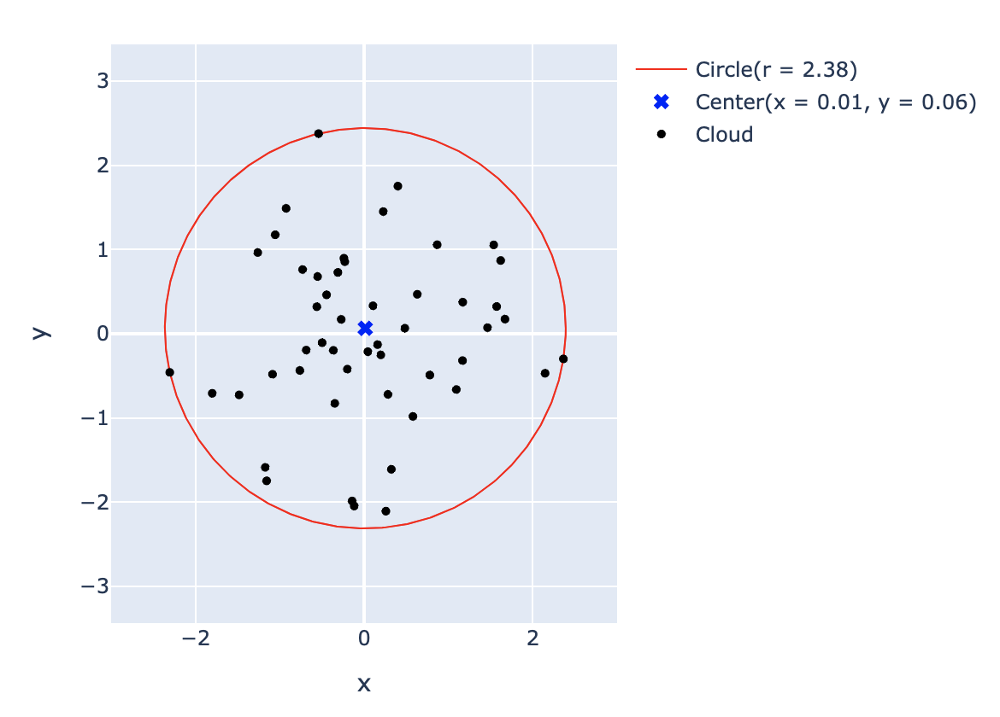

# 🔵 [cvxball](https://www.cvxgrp.org/cvxball)

[](LICENSE)

## 📋 Overview

We compute the smallest enclosing circle/ball for a set of points.



```python
import numpy as np
from cvxball import min_circle_clarabel

# create a numpy array where each row corresponds to a point
points = np.array([[2.0, 4.0], [0, 0], [2.5, 2.0]])

# compute the smallest enclosing circle
radius, centre = min_circle_clarabel(points)
```

### 🔧 The solvers

Two solvers share one interface — both take `(points, verbose=False)` and
return `(radius, center)` — so they are interchangeable:

| Solver | Approach |
|---|---|
| **`min_circle_clarabel`** | Assembles the second-order cone program directly and calls [Clarabel](https://clarabel.org), with no modelling-layer canonicalisation in between. |
| **`min_circle_active_set`** | Runs an active-set QP method on the *dual* of the same problem. Pure NumPy, no solver dependency. |

```python
from cvxball.solver import min_circle_active_set

radius, centre = min_circle_active_set(points)  # same call, same result
```

The active-set method keeps a *support set* of points held on the ball's
boundary and repeatedly re-centres the ball on that set, dropping a support
point whose dual weight would turn negative and adding the farthest point still
left outside. Each iteration is one small dense solve of size at most the
ambient dimension, so its cost is driven by $d$ rather than by $n$.

Two consequences are worth knowing when picking between them. The active-set
method stops at an *exact vertex* of the dual feasible set instead of at an
interior-point tolerance, so on inputs where the answer is determined exactly —
points already lying on a common sphere, say — it returns the radius to machine
precision where an interior-point solver lands within its own tolerance. And
because it touches all $n$ points only to find the next farthest one, it scales
much better in $n$: on $20\,000$ points in $\mathbb{R}^{10}$ it is roughly
three orders of magnitude faster here. The cone program, in exchange, is the
more familiar formulation and the one to reach for if you want to extend the
model with further conic constraints.

## 🧮 Background

We are solving the convex optimization problem:

$$
\min_r \quad r
$$

subject to the constraint that for each point $p_i$, the Euclidean
distance from $p_i$ to the center of the circle is less than or
equal to the radius $r$:

$$
\| p_i - \text{center} \| \leq r, \quad \forall i = 1, 2, \dots, n
$$

Where:

- $p_i$ are the points in $\mathbb{R}^d$.
- $\text{center}$ is the center of the circle we are trying to find.
- $r$ is the radius of the circle.

The goal is to minimize the radius $r$ such that all points
lie inside or on the boundary of the circle.

---

### 📊 Interpretation as a Min/Max Problem

The constraint $\| p_i - \text{center} \| \leq r$ implies that
the radius $r$ must be at least as large as the maximum distance
from the center to any of the points $p_i$.

If we define the distance from the center to each point as:

$$
d_i = \| p_i - \text{center} \|
$$

Then, the radius $r$ must satisfy:

$$
r \geq \max_i d_i
$$

Thus, the optimization problem becomes:

$$
r = \min \max_i d_i
$$

This is a **min-max** problem, where we want to
minimize the maximum distance from the center to any of the points.
In other words, we are looking for the smallest possible radius $r$
such that the maximum distance from the center to any point is minimized.

---

### 📐 Geometric Interpretation

Geometrically, the problem is about finding the **smallest enclosing circle**
(or ball in higher dimensions) that contains all the given points.
The center of the circle is positioned in such a way that the radius
is minimized, but all points still lie inside or on the boundary of the circle.

- **Convexity**: The objective function $r = \min \max_i d_i$ is
convex, as the maximum of a set of convex functions is convex.
Minimizing a convex function over a convex set is a convex optimization problem.

- **Center and Radius**: The solution involves determining
both the center and the radius of the circle.
The optimal center minimizes the maximum distance to any of the points,
and the optimal radius ensures all points are inside
or on the boundary of the circle.

---

### ♊ The dual, and what the active-set method exploits

Attaching multipliers $u_i \geq 0$ to the constraints above and eliminating the
centre gives the dual problem

$$
\max_u \quad \sum_i u_i \|p_i\|^2 - \Big\| \sum_i u_i p_i \Big\|^2
\qquad \text{subject to} \quad u \geq 0, \ \sum_i u_i = 1,
$$

a quadratic program over the unit simplex. At the optimum the centre is the
weighted average $\text{center} = \sum_i u_i p_i$ and the objective value is
$r^2$. The complementary slackness conditions read

$$
\|p_i - \text{center}\| = r \ \text{ where } u_i > 0,
\qquad
\|p_i - \text{center}\| \leq r \ \text{ where } u_i = 0,
$$

which is exactly the geometric statement that the ball is pinned by the points
on its boundary and encloses everything else. Those boundary points are the
*support set*, they number at most $d + 1$, and the centre is a convex
combination of them.

That is what makes an active-set method natural here: the whole problem is
determined by which handful of points sit on the boundary. The method searches
over support sets directly, and every candidate it produces carries its own
optimality certificate.
